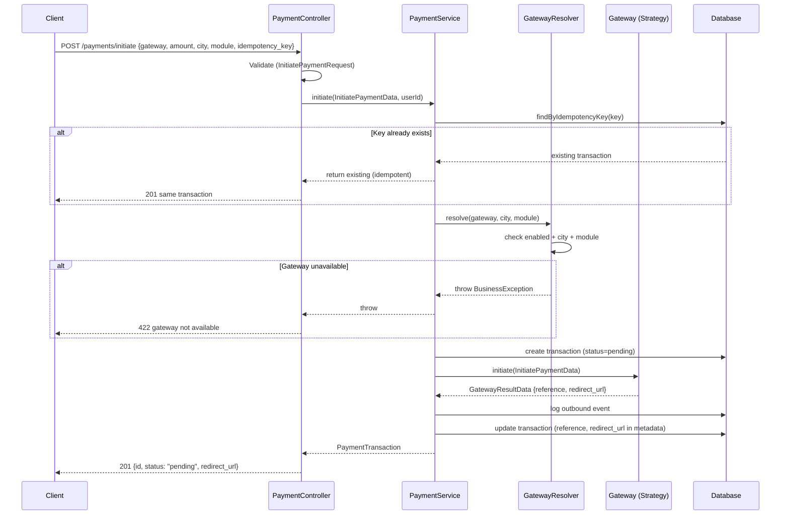
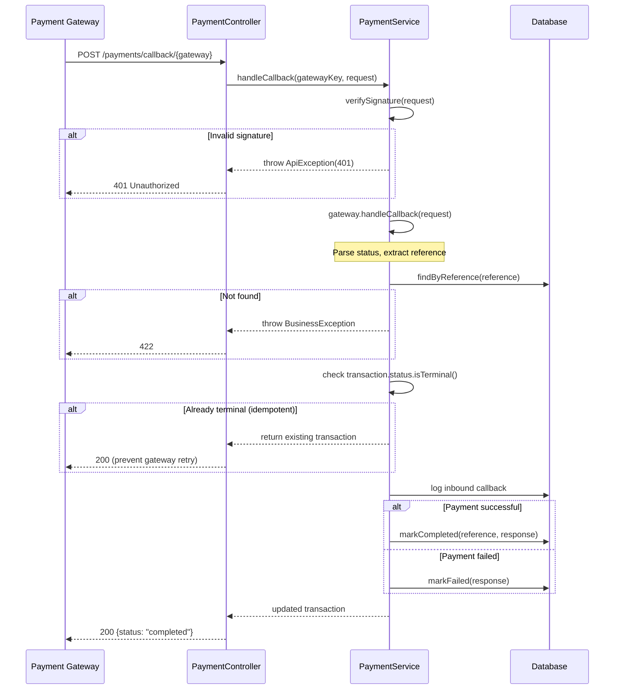
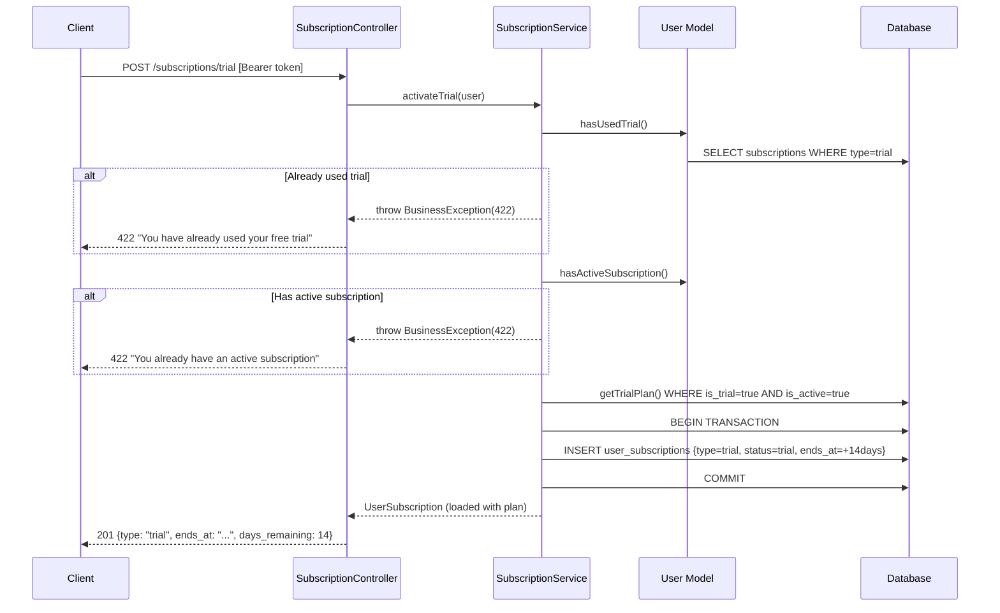
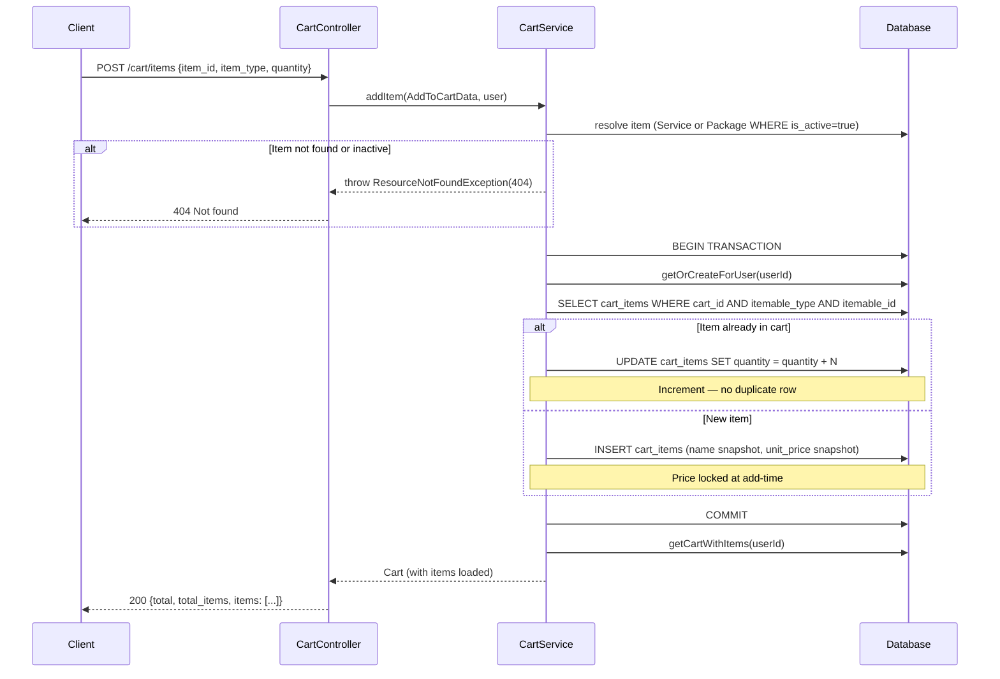
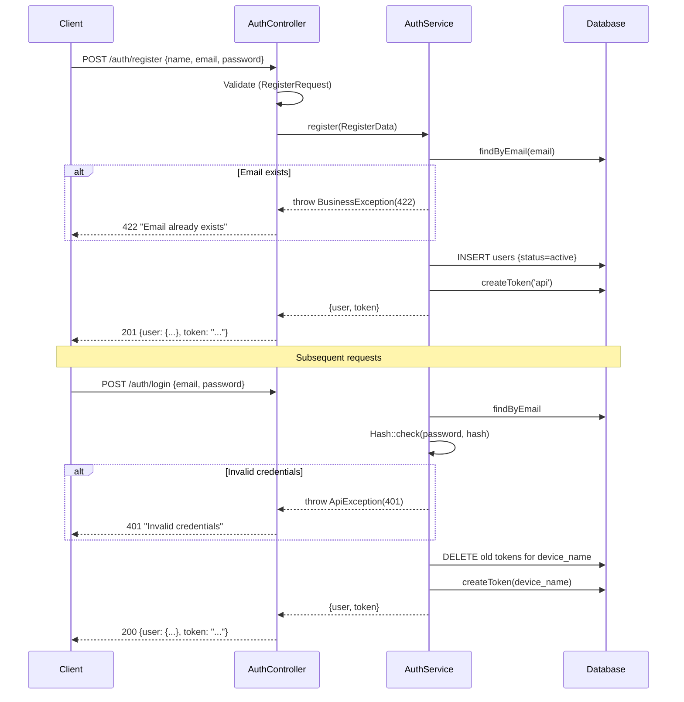

# Ajeer — Technical Assessment
### Senior Laravel Developer | 5-Day Assessment

> Laravel 13 · PHP 8.3 · MySQL 8.0 · Sanctum · Pest

---

## Table of Contents

1. [Quick Setup](#quick-setup)
2. [Architecture Overview](#architecture-overview)
3. [Design Patterns](#design-patterns)
4. [Database Design](#database-design)
5. [API Reference](#api-reference)
6. [Sequence Flows](#sequence-flows)
7. [Logging Strategy](#logging-strategy)
8. [High-Traffic Considerations](#high-traffic-considerations)
9. [Testing](#testing)
10. [Module Roadmap](#module-roadmap)

---

## Quick Setup

### Requirements
| Dependency | Version |
|---|---|
| PHP | 8.3+ |
| Composer | 2.x |
| MySQL | 8.0+ |
| Laravel | 13.x |

### Install & Run

```bash
git clone <repo-url>
cd ajeer-assessment
composer install
cp .env.example .env
php artisan key:generate
```

Configure `.env`:
```env
DB_DATABASE=ajeer_assessment
DB_USERNAME=root
DB_PASSWORD=

PAYMENT_GATEWAY_DEFAULT=moyasar
MOYASAR_ENABLED=true
STRIPE_ENABLED=true
TAP_ENABLED=true
TRIAL_ENABLED=true
TRIAL_DURATION_DAYS=14
```

```bash
php artisan migrate
php artisan db:seed
php artisan serve
```

**API Base URL:** `http://localhost:8000/api/v1`
**Demo credentials:** `demo@ajeer.app` / `password`
**API Explorer:** `http://localhost:8000/explorer.html`

### Ajeer API Explorer & User Journey

To visually explore, run, and verify the entire API suite without external tools like Postman, we have built a beautiful, premium **Ajeer API Explorer** accessible locally at `http://localhost:8000/explorer.html`.

#### Key Highlights & Improvements:
1. **API Health & Diagnostic Checks**: Added `/api/v1/health` as step `0` to instantly verify connectivity.
2. **Logical Sequential Numbering (1 - 22)**: All 22 endpoints are grouped and ordered chronologically to follow a complete customer journey:
   - **1. Authentication**: Register (`/auth/register`), Login (`/auth/login`), Profile (`/auth/me`).
   - **2. Subscriptions**: List Plans (`/subscriptions/plans`), Activate Free Trial (`/subscriptions/trial`), Status (`/subscriptions/my`).
   - **3. Services & Booking**: List Services (`/services`), View Details (`/services/{id}`), Book Service (`/services/{id}/book`).
   - **4. Packages & Cart**: List Packages (`/packages`), View Details (`/packages/{id}`), Add via custom endpoint (`/packages/{id}/add-to-cart`), View Cart (`/cart`), Add generic item (`/cart/items`), Delete single item (`/cart/items/{id}`), Clear Cart (`/cart`).
   - **5. Payments & Transactions**: Gateways (`/payments/gateways`), Initiate (`/payments/initiate`), Simulate Callback (`/payments/callback/{gateway}`), List Transactions (`/payments/transactions`), View Details (`/payments/transactions/{id}`).
   - **Logout**: Logout (`/auth/logout`) to gracefully invalidate sessions.
3. **Response Panel Fixes**: Standardized layouts so GET and POST requests cleanly display formatted responses, response headers, performance times, and syntax-highlighted JSON.
4. **Interactive Scenarios**: Fully-automated quick test scenarios (Idempotency checks, Cart flows, Free trial limits, Gateway city filters) executable directly in-browser.

---

## Architecture Overview

```
app/
├── Modules/               # Feature modules (self-contained)
│   ├── Auth/
│   ├── Payment/           # Strategy Pattern — gateway system
│   ├── Subscription/
│   ├── Service/
│   ├── Package/
│   └── Cart/
├── Http/
│   ├── Controllers/Api/V1/  # Thin controllers — no business logic
│   ├── Requests/Api/V1/     # Validation layer
│   └── Resources/Api/V1/   # Response transformation
├── Repositories/
│   ├── Contracts/           # Interfaces (decoupled)
│   └── Eloquent/            # Implementations (swappable)
├── Services/                # Business logic layer
├── Models/                  # Eloquent models (BaseModel + ULID)
├── Enums/                   # PHP 8.1+ backed enums (no magic strings)
├── Data/                    # DTOs via spatie/laravel-data
├── Exceptions/              # Domain-specific exceptions
└── Traits/                  # ApiResponse, Loggable
```

**Request lifecycle:**

```
Request → Middleware → FormRequest → Controller → Service → Repository → Model
                                         ↓
                                    DTO (typed input)
                                         ↓
                                    Exception Handler → JSON Response
```

---

## Design Patterns

### 1. Strategy Pattern — Payment Gateways

Each gateway implements a shared contract. The system resolves the correct
strategy at runtime based on config — no if/else chains.

```
PaymentGatewayInterface (contract)
├── MoyasarGateway   implements PaymentGatewayInterface
├── StripeGateway    implements PaymentGatewayInterface
└── TapGateway       implements PaymentGatewayInterface

GatewayResolver → reads config → instantiates correct strategy
```

**Adding a new gateway requires only:**
1. Create `app/Modules/Payment/Gateways/NewGateway.php`
2. Add config entry in `config/payment_gateways.php`
3. Zero changes to existing code

### 2. Repository Pattern

Controllers and Services depend on **interfaces**, not concrete classes.
All bindings live in `RepositoryServiceProvider`.

```
Controller → Service → RepositoryInterface ← (bound in IoC) ← EloquentRepository
```

**Benefit:** Swap Eloquent for any data source without touching business logic.

### 3. Service Layer

All business rules live in Service classes.
Controllers only: validate input → call service → return response.

### 4. DTO Pattern (spatie/laravel-data)

Services receive typed DTOs instead of raw arrays.
Every service method signature is self-documenting.

```php
// Not this:
public function initiate(array $data): PaymentTransaction

// This:
public function initiate(InitiatePaymentData $data, string $userId): PaymentTransaction
```

---

## Database Design

### Entity Relationships

```
users
 ├─< user_subscriptions >── subscription_plans
 ├─< service_bookings   >── services >── service_categories
 ├── carts ──< cart_items (polymorphic: Service | Package)
 └─< payment_transactions ──< payment_gateway_logs

packages >──< services  (via package_services pivot)
```

### Key Design Decisions

| Decision | Reason |
|---|---|
| **ULID primary keys** | Sortable by time, no enumeration attacks, distributed-system safe |
| **SoftDeletes on all tables** | Audit trail, data recovery, referential integrity |
| **Enum columns** | PHP-backed enums enforce valid values at code level |
| **JSON columns** | `metadata`, `gateway_response`, `features` — flexible without schema changes |
| **Composite indexes** | `[user_id, status]`, `[user_id, created_at]` — covers common query patterns |
| **Polymorphic cart_items** | One cart item can hold a Service or Package without separate tables |
| **Price snapshot in cart** | `unit_price` stored at add-time — price changes don't affect existing carts |
| **idempotency_key (unique)** | DB-enforced idempotency prevents duplicate payments even under concurrent requests |
| **payment_gateway_logs** | Immutable audit log, no soft deletes, separate from transactions |

### Tables Overview

| Table | Rows (seeded) | Purpose |
|---|---|---|
| users | 1+ | Authenticatable users with ULID + SoftDeletes |
| payment_transactions | 4 | Payment records with idempotency |
| payment_gateway_logs | — | Immutable audit log per gateway event |
| subscription_plans | 3 | trial · basic · pro |
| user_subscriptions | — | Active/past subscriptions per user |
| service_categories | 4 | Plumbing · Electrical · Cleaning · AC |
| services | 8 | 2 per category |
| service_bookings | — | User ↔ Service scheduling |
| packages | 1 | Home Care Bundle (3 services) |
| package_services | 3 | Pivot: package ↔ service with sort_order |
| carts | — | One per user (unique constraint) |
| cart_items | — | Polymorphic: service or package |

---

## API Reference

All endpoints are versioned under `/api/v1/`. Protected routes require:
`Authorization: Bearer {token}`

### Auth
| Method | Endpoint | Auth | Description |
|---|---|---|---|
| POST | `/auth/register` | — | Register + receive token |
| POST | `/auth/login` | — | Login + receive token |
| POST | `/auth/logout` | ✅ | Revoke current token |
| GET | `/auth/me` | ✅ | Authenticated user profile |

### Payments
| Method | Endpoint | Auth | Description |
|---|---|---|---|
| GET | `/payments/gateways?city=&module=` | — | Available gateways (filtered) |
| POST | `/payments/initiate` | ✅ | Start a payment, get redirect URL |
| POST | `/payments/callback/{gateway}` | — | Gateway webhook (signature verified) |
| GET | `/payments/transactions` | ✅ | Paginated transaction history |
| GET | `/payments/transactions/{id}` | ✅ | Single transaction detail |

### Subscriptions
| Method | Endpoint | Auth | Description |
|---|---|---|---|
| GET | `/subscriptions/plans` | — | Available paid plans |
| POST | `/subscriptions/trial` | ✅ | Activate 14-day free trial (once only) |
| GET | `/subscriptions/my` | ✅ | Current active subscription |

### Services
| Method | Endpoint | Auth | Description |
|---|---|---|---|
| GET | `/services?category_id=` | — | Paginated service listing |
| GET | `/services/{id}` | — | Single service detail |
| POST | `/services/{id}/book` | ✅ | Schedule a service booking |

### Packages
| Method | Endpoint | Auth | Description |
|---|---|---|---|
| GET | `/packages` | — | Paginated package listing |
| GET | `/packages/{id}` | — | Package with all services |
| POST | `/packages/{id}/add-to-cart` | ✅ | Add package to cart |

### Cart
| Method | Endpoint | Auth | Description |
|---|---|---|---|
| GET | `/cart` | ✅ | View cart with items and totals |
| POST | `/cart/items` | ✅ | Add service or package |
| DELETE | `/cart/items/{id}` | ✅ | Remove single item |
| DELETE | `/cart` | ✅ | Clear entire cart |

### Response Format

All responses follow a consistent structure:

```json
// Success
{ "success": true, "message": "...", "data": { ... } }

// Paginated
{ "success": true, "message": "...", "data": [...], "meta": { "current_page": 1, "last_page": 3, "per_page": 15, "total": 42 } }

// Error
{ "success": false, "message": "...", "errors": { ... } }
```

---

## Sequence Flows

### Payment Initiation Flow



### Gateway Callback / Webhook Flow



### Trial Subscription Flow



### Cart Add Item Flow



### Auth Flow



---

## Logging Strategy

Three dedicated log channels, each with a specific purpose and retention policy:

| Channel | File | Retention | Content |
|---|---|---|---|
| `app` | `storage/logs/app.log` | 30 days | Business events: login, register, booking, trial activation |
| `api_requests` | `storage/logs/api_requests.log` | 14 days | Every HTTP request: method, URL, user_id, status, duration_ms |
| `payment` | `storage/logs/payment.log` | 90 days | All gateway events: outbound calls, inbound callbacks, amounts |

**Request logging** is handled by `RequestLogger` middleware — automatically
appended to every API request with zero boilerplate in controllers.

**Business logging** uses the `Loggable` trait in Service classes.
Every significant action logs `class`, `user_id`, `ip`, and action-specific context.

**Payment logs** are kept 90 days for financial compliance and dispute resolution.

```
// Example api_requests.log entry
[2026-05-24 10:23:41] api_requests.INFO: API Request {
  "method": "POST",
  "url": "http://localhost:8000/api/v1/payments/initiate",
  "ip": "127.0.0.1",
  "user_id": "01HX...",
  "status_code": 201,
  "duration_ms": 87.4,
  "user_agent": "PostmanRuntime/7.x"
}
```

---

## High-Traffic Considerations

| Concern | Implementation |
|---|---|
| **N+1 Prevention** | `Model::shouldBeStrict()` in non-production — throws on lazy loading |
| **Eager Loading** | All repository methods accept `$relations` param, eager load by default |
| **Idempotency** | `idempotency_key` with DB unique constraint — safe under concurrent requests |
| **DB Indexing** | Composite indexes on `[user_id, status]`, `[user_id, created_at]` — covers pagination |
| **ULID Keys** | No auto-increment lock contention at high insert rates |
| **Terminal State Check** | Callbacks skip processing if transaction already terminal — prevents race conditions |
| **Token Rotation** | Login revokes previous tokens for the same device — limits token proliferation |
| **Pagination** | All list endpoints paginated (`per_page` capped at 50) |
| **Throttling** | `middleware->throttleApi()` applied globally in `bootstrap/app.php` |

**To scale further (beyond this assessment scope):**
- Add Redis cache for gateway availability lookups
- Queue payment callback processing via Laravel Horizon
- Read replicas for transaction history queries
- Rate limiting per user_id on payment initiation

---

## Testing

```bash
php artisan test          # Run all tests
php artisan test --verbose # With test names
php artisan test --coverage # With coverage report
```

| Suite | File | Tests |
|---|---|---|
| Health | `tests/Feature/Api/V1/HealthTest.php` | 2 |
| Available Gateways | `tests/Feature/Api/V1/Payment/AvailableGatewaysTest.php` | 3 |
| Payment Initiation | `tests/Feature/Api/V1/Payment/InitiatePaymentTest.php` | 4 |
| Gateway Resolver | `tests/Unit/Payment/GatewayResolverTest.php` | 4 |
| Auth | `tests/Feature/Api/V1/Auth/AuthTest.php` | 6 |
| Subscriptions | `tests/Feature/Api/V1/Subscription/SubscriptionTest.php` | 3 |
| Services | `tests/Feature/Api/V1/Service/ServiceTest.php` | 3 |
| Cart | `tests/Feature/Api/V1/Cart/CartTest.php` | 4 |

---

## Module Roadmap

| Module | Status | Phase |
|---|---|---|
| Base structure (Repository + Service + DTO + Enums) | ✅ Complete | 1 |
| Multi-gateway payment system (Strategy Pattern) | ✅ Complete | 2 |
| Auth (Register / Login / Logout / Me) | ✅ Complete | 3 |
| Trial subscriptions | ✅ Complete | 3 |
| Service browsing + booking | ✅ Complete | 3 |
| Package management + cart add | ✅ Complete | 3 |
| Polymorphic cart (Service + Package) | ✅ Complete | 3 |

---
