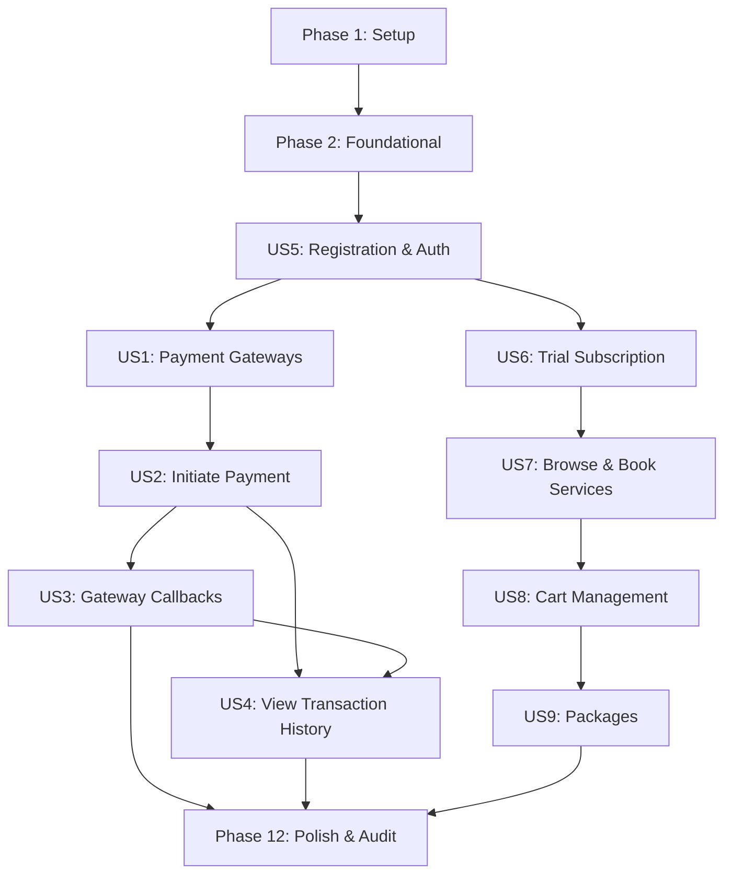

# Tasks: Ajeer Assessment Laravel API Setup

**Input**: Design documents from `/specs/001-laravel-api-setup/`

**Prerequisites**: plan.md (required), spec.md (required for user stories), research.md, data-model.md, contracts/

**Tests**: This project strictly enforces **Pest** functional testing syntax (§T-1). Every user story includes a Pest test task to be written first.

**Organization**: Tasks are grouped by user story to enable independent implementation and testing of each story.

## Format: `[ID] [P?] [Story] Description`

- **[P]**: Can run in parallel (different files, no dependencies within the phase)
- **[Story]**: Which user story this task belongs to (e.g., US1, US2, US3, US4, US5, US6, US7, US8, US9)
- Include exact file paths in descriptions

---

## Phase 1: Setup (Shared Infrastructure)

**Purpose**: Project initialization and basic structure

- [x] T001 Initialize composer dependencies for spatie/laravel-data in composer.json
- [x] T002 Configure PHP 8.3 strict types verification config in phpunit.xml and pint.json
- [x] T003 [P] Create the base api v1 routes file in routes/api_v1.php

---

## Phase 2: Foundational (Blocking Prerequisites)

**Purpose**: Core infrastructure that MUST be complete before ANY user story can be implemented

**⚠️ CRITICAL**: No user story work can begin until this phase is complete.

- [x] T004 Setup Model strict mode `Model::shouldBeStrict()` in app/Providers/AppServiceProvider.php (§C-4)
- [x] T005 Create base versioning middleware ApiVersionMiddleware in app/Http/Middleware/ApiVersionMiddleware.php (§A-5)
- [x] T006 [P] Create base exception handling conversion in app/Exceptions/Handler.php (§S-3, §S-4)
- [x] T007 [P] Implement custom log channels in config/logging.php (§L-1, §L-4)
- [x] T008 [P] Implement RequestLogger middleware in app/Http/Middleware/RequestLogger.php (§L-2)
- [x] T009 Create Loggable service trait in app/Services/Traits/Loggable.php (§L-3)
- [x] T010 [P] Define BaseApiTestCase helpers or uses bindings in tests/Pest.php (§T-4)

**Checkpoint**: Foundation ready - user story implementation can now begin.

---

## Phase 3: User Story 5 - User Registration & Authentication (Priority: P1) 🎯 MVP Core

**Goal**: Allow visitors to register, log in, and logout via Sanctum bearer tokens with JSON response validation.

**Independent Test**: Call `POST /api/v1/auth/register` and `POST /api/v1/auth/login` using Pest HTTP helpers, checking for bearer token format and successful HTTP 201/200 returns.

### Tests for User Story 5
- [x] T011 [P] [US5] Create registration, login, and logout Pest feature tests in tests/Feature/Api/V1/AuthTest.php

### Implementation for User Story 5
- [x] T012 [P] [US5] Add `HasUlids` trait and backed enum status cast to User model in app/Models/User.php (§C-3, §D-3)
- [x] T013 [P] [US5] Create UserRepository interface in app/Repositories/Contracts/UserRepositoryInterface.php (§A-1)
- [x] T014 [P] [US5] Create Eloquent UserRepository implementation in app/Repositories/Eloquent/UserRepository.php (§A-1)
- [x] T015 [P] [US5] Create registration DTO RegisterData in app/Data/Auth/RegisterData.php (§A-4)
- [x] T016 [P] [US5] Create login DTO LoginData in app/Data/Auth/LoginData.php (§A-4)
- [x] T017 [US5] Create AuthService in app/Services/AuthService.php using Loggable trait (§A-2, §L-3)
- [x] T018 [US5] Create AuthController in app/Http/Controllers/Api/V1/AuthController.php (§A-5, §S-4)
- [x] T019 [US5] Register authentication endpoints under `/api/v1/` prefix in routes/api_v1.php

**Checkpoint**: User Story 5 is fully functional. Authenticable API requests are now unblocked.

---

## Phase 4: User Story 1 - Retrieve Available Payment Gateways (Priority: P1) 🎯 MVP

**Goal**: Retrieve payment gateways available for a given city and module.

**Independent Test**: Call `GET /api/v1/payments/gateways?city=Riyadh&module=booking` and assert only Moyasar and Tap are returned.

### Tests for User Story 1
- [x] T020 [P] [US1] Create payment gateways availability Pest feature tests in tests/Feature/Api/V1/PaymentTest.php

### Implementation for User Story 1
- [x] T021 [P] [US1] Create payment config driver and gateways definition rules in config/payments.php (§FR-001)
- [x] T022 [P] [US1] Define PaymentGateway backed Enum in app/Enums/PaymentGateway.php (§C-2)
- [x] T023 [P] [US1] Define PaymentGatewayInterface in app/Services/Payment/Contracts/PaymentGatewayInterface.php (§A-3)
- [x] T024 [P] [US1] Create MoyasarGateway stub in app/Services/Payment/Gateways/MoyasarGateway.php (§A-3)
- [x] T025 [P] [US1] Create StripeGateway stub in app/Services/Payment/Gateways/StripeGateway.php (§A-3)
- [x] T026 [P] [US1] Create TapGateway stub in app/Services/Payment/Gateways/TapGateway.php (§A-3)
- [x] T027 [US1] Create PaymentManager factory resolver in app/Services/Payment/PaymentManager.php (§A-3)
- [x] T028 [US1] Create PaymentService in app/Services/Payment/PaymentService.php (§A-2, §L-3)
- [x] T029 [US1] Create PaymentController gateway check endpoint in app/Http/Controllers/Api/V1/PaymentController.php (§A-5)

**Checkpoint**: Gateway availability queries return filtered results based on city and module rules.

---

## Phase 5: User Story 2 - Initiate a Payment (Priority: P1) 🎯 MVP

**Goal**: Authenticated user can initiate a payment, creating a pending transaction record and returning redirect URL.

**Independent Test**: Authenticate a user and post to `/api/v1/payments/initiate` with valid gateway, amount, and module. Assert `payment_transactions` DB has a pending row.

### Tests for User Story 2
- [x] T030 [P] [US2] Create payment initiation Pest feature tests in tests/Feature/Api/V1/PaymentTest.php

### Implementation for User Story 2
- [x] T031 [P] [US2] Create TransactionStatus, Currency, and PaymentModule backed Enums in app/Enums/ (§C-2)
- [x] T032 [P] [US2] Create PaymentTransaction model with ULID and SoftDeletes in app/Models/PaymentTransaction.php (§C-3, §D-1)
- [x] T033 [P] [US2] Create PaymentTransactionRepository interface in app/Repositories/Contracts/PaymentTransactionRepositoryInterface.php (§A-1)
- [x] T034 [P] [US2] Create Eloquent PaymentTransactionRepository implementation in app/Repositories/Eloquent/PaymentTransactionRepository.php (§A-1)
- [x] T035 [P] [US2] Create DTO PaymentInitiateData in app/Data/Payment/PaymentInitiateData.php (§A-4)
- [x] T036 [P] [US2] Create DTO PaymentResponseData in app/Data/Payment/PaymentResponseData.php (§A-4)
- [x] T037 [US2] Implement initiate method inside PaymentGateway interface and stubs (§A-3)
- [x] T038 [US2] Implement payment initiation inside PaymentService using payment repository (§A-2, §L-3)
- [x] T039 [US2] Implement initiation endpoint inside PaymentController in app/Http/Controllers/Api/V1/PaymentController.php (§A-5)

**Checkpoint**: Payments can be successfully initiated, producing secure redirect tokens and pending transactions.

---

## Phase 6: User Story 3 - Handle Gateway Callbacks (Priority: P1) 🎯 MVP

**Goal**: Process payment gateway webhooks/callbacks idempotently and update transaction statuses.

**Independent Test**: Send `POST /api/v1/payments/callback/{gateway}` simulating success callback, assert transaction shifts to `success`, and verify duplicate callbacks yield no extra state changes.

### Tests for User Story 3
- [x] T040 [P] [US3] Create gateway callback and idempotency Pest feature tests in tests/Feature/Api/V1/PaymentTest.php

### Implementation for User Story 3
- [x] T041 [P] [US3] Create DTO PaymentCallbackData in app/Data/Payment/PaymentCallbackData.php (§A-4)
- [x] T042 [US3] Implement callback handler inside PaymentGateway interface and Moyasar/Stripe/Tap gateway drivers (§A-3)
- [x] T043 [US3] Implement idempotent transaction completion inside PaymentService in app/Services/Payment/PaymentService.php (§A-2, §L-3)
- [x] T044 [US3] Implement callback webhook endpoint inside PaymentController in app/Http/Controllers/Api/V1/PaymentController.php (§A-5)

**Checkpoint**: Gateway status updates are processed and stored idempotently.

---

## Phase 7: User Story 6 - Activate Trial Subscription (Priority: P2)

**Goal**: Allow new users to activate a free one-time-only 14-day trial subscription.

**Independent Test**: Register a user and call `POST /api/v1/subscriptions/trial`. Verify subscription lasts exactly 14 days and a second call triggers a validation error.

### Tests for User Story 6
- [x] T045 [P] [US6] Create subscription activation Pest feature tests in tests/Feature/Api/V1/SubscriptionTest.php

### Implementation for User Story 6
- [x] T046 [P] [US6] Create SubscriptionPlan and SubscriptionStatus Enums in app/Enums/ (§C-2)
- [x] T047 [P] [US6] Create Subscription model with ULID and SoftDeletes in app/Models/Subscription.php (§C-3, §D-1)
- [x] T048 [P] [US6] Create SubscriptionRepository interface in app/Repositories/Contracts/SubscriptionRepositoryInterface.php (§A-1)
- [x] T049 [P] [US6] Create Eloquent SubscriptionRepository implementation in app/Repositories/Eloquent/SubscriptionRepository.php (§A-1)
- [x] T050 [P] [US6] Create DTO SubscriptionData in app/Data/Subscription/SubscriptionData.php (§A-4)
- [x] T051 [US6] Implement trial activation logic inside SubscriptionService in app/Services/SubscriptionService.php (§A-2, §L-3)
- [x] T052 [US6] Implement trial subscription Controller in app/Http/Controllers/Api/V1/SubscriptionController.php (§A-5)
- [x] T053 [US6] Register subscription routes under auth:sanctum prefix in routes/api_v1.php

**Checkpoint**: Trial activations are enforced per-user and expire mathematically after 14 days.

---

## Phase 8: User Story 7 - Browse and Book Services (Priority: P2)

**Goal**: Allow active subscribers to browse services and book an appointment for a specific date.

**Independent Test**: Request `GET /api/v1/services`. Authenticate subscriber and call `POST /api/v1/services/{id}/book`. Assert booking persists with `confirmed` status.

### Tests for User Story 7
- [x] T054 [P] [US7] Create services browsing and booking Pest feature tests in tests/Feature/Api/V1/BookingTest.php

### Implementation for User Story 7
- [x] T055 [P] [US7] Create Service model with ULID and SoftDeletes in app/Models/Service.php (§C-3, §D-1)
- [x] T056 [P] [US7] Create Booking model with ULID and SoftDeletes in app/Models/Booking.php (§C-3, §D-1)
- [x] T057 [P] [US7] Create ServiceRepository interface and BookingRepository interface (§A-1)
- [x] T058 [P] [US7] Create Eloquent ServiceRepository and BookingRepository implementations (§A-1)
- [x] T059 [P] [US7] Create BookingStatus Enum in app/Enums/BookingStatus.php (§C-2)
- [x] T060 [P] [US7] Create DTO BookingData in app/Data/Booking/BookingData.php (§A-4)
- [x] T061 [US7] Implement booking creation and subscription checks inside BookingService in app/Services/BookingService.php (§A-2, §L-3)
- [x] T062 [US7] Implement ServiceController and BookingController in app/Http/Controllers/Api/V1/ (§A-5)
- [x] T063 [US7] Register service browsing and booking routes in routes/api_v1.php

**Checkpoint**: Maintenance services can be browsed, and active subscribers can successfully schedule bookings.

---

## Phase 9: User Story 4 - View Transaction History (Priority: P2)

**Goal**: Authenticated user can view their paginated transaction history and individual record details.

**Independent Test**: Call `GET /api/v1/payments/transactions` and ensure results are paginated and scoped to current authenticated user.

### Tests for User Story 4
- [ ] T064 [P] [US4] Create transaction history Pest feature tests in tests/Feature/Api/V1/PaymentTest.php

### Implementation for User Story 4
- [x] T065 [US4] Add pagination query parameters and scoping logic inside PaymentTransactionRepository (§A-1)
- [x] T066 [US4] Add `getTransactionsForUser` method inside PaymentService in app/Services/Payment/PaymentService.php (§A-2)
- [x] T067 [US4] Add transaction listing & details actions inside PaymentController in app/Http/Controllers/Api/V1/PaymentController.php (§A-5)

**Checkpoint**: Users can reliably audit and browse their transaction details page-by-page.

---

## Phase 10: User Story 8 - Cart Management (Priority: P3)

**Goal**: Authenticated users can manage a persistent user-scoped shopping cart.

**Independent Test**: Call `POST /api/v1/cart/items` with a valid service ID, and assert cart returns the exact item and price recalculation.

### Tests for User Story 8
- [ ] T068 [P] [US8] Create cart management Pest feature tests in tests/Feature/Api/V1/CartTest.php

### Implementation for User Story 8
- [x] T069 [P] [US8] Create Cart and CartItem models with ULIDs and SoftDeletes in app/Models/ (§C-3, §D-1)
- [x] T070 [P] [US8] Create CartRepository interface and Eloquent implementation (§A-1)
- [x] T071 [P] [US8] Create DTO CartItemData in app/Data/Cart/CartItemData.php (§A-4)
- [x] T072 [US8] Implement cart addition, removal, and clearing inside CartService in app/Services/CartService.php (§A-2, §L-3)
- [x] T073 [US8] Implement CartController in app/Http/Controllers/Api/V1/CartController.php (§A-5)
- [x] T074 [US8] Register cart routes in routes/api_v1.php

**Checkpoint**: User-scoped shopping carts are fully persistent and reactive to individual item changes.

---

## Phase 11: User Story 9 - Packages (Priority: P3)

**Goal**: Browse bundled packages and expand them to individual services inside user cart.

**Independent Test**: Call `POST /api/v1/packages/{id}/add-to-cart` and assert cart expands to the pre-bundled individual services.

### Tests for User Story 9
- [ ] T075 [P] [US9] Create package expansion Pest feature tests in tests/Feature/Api/V1/PackageTest.php

### Implementation for User Story 9
- [x] T076 [P] [US9] Create Package model with ULID and SoftDeletes in app/Models/Package.php (§C-3, §D-1)
- [x] T077 [P] [US9] Create PackageRepository interface and Eloquent implementation (§A-1)
- [x] T078 [US9] Implement package expansion logic within PackageService in app/Services/PackageService.php (§A-2, §L-3)
- [x] T079 [US9] Implement PackageController in app/Http/Controllers/Api/V1/PackageController.php (§A-5)
- [x] T080 [US9] Register package endpoints in routes/api_v1.php

**Checkpoint**: Multi-service packages are expanded correctly into distinct cart lines.

---

### Phase 12: Polish & Cross-Cutting Concerns

**Purpose**: System validation, final seeders, and compliance auditing

- [x] T081 Create robust database seeders for users, services, and packages in database/seeders/DatabaseSeeder.php (§C-5)
- [ ] T082 Run all Pest test suites and achieve 100% success rate (`php artisan test`) (§T-1, §SC-008)
- [ ] T083 Verify request logs are saved cleanly to api_requests channel in storage/logs/api_requests.log (§L-2)
- [ ] T084 Verify payment gateway audit trail logs are populated in storage/logs/payment.log (§L-1)
- [ ] T085 Run quickstart.md validation checklist for all configuration driver swaps (§SC-010)
- [x] T086 Review all codebase strict types, ULIDs, and DTO declarations for absolute compliance (§C-1..§C-5)

---

## Dependencies & Execution Order

### Phase Dependencies

### Parallel Opportunities

- All Setup tasks marked [P] (T001, T002, T003) can be executed concurrently.
- All Foundational tasks marked [P] (T006, T007, T008, T010) are parallelizable within Phase 2.
- In each User Story phase, model creation and repository interfaces marked [P] can run concurrently before their service/controller assemblies.

---

## Implementation Strategy

### MVP First (Core Payments Flow)
1. Complete Setup and Foundational constraints (Phase 1 & 2).
2. Complete Auth (Phase 3) to enable authenticated requests.
3. Complete Retrieve Gateways availability engine (Phase 4).
4. Complete Payment Initiation & Callback validation (Phases 5 & 6).
5. **PAUSE AND VALIDATE**: Execute comprehensive test coverage against payment routes to prove stability.

### Incremental Subscription & Booking Flows
1. Layer on Trial Subscriptions (Phase 7).
2. Establish maintenance catalog & Bookings (Phase 8).
3. Connect Carts (Phase 9 & 10).
4. Expand Packages (Phase 11).
5. Complete comprehensive validation and seeding (Phase 12).
